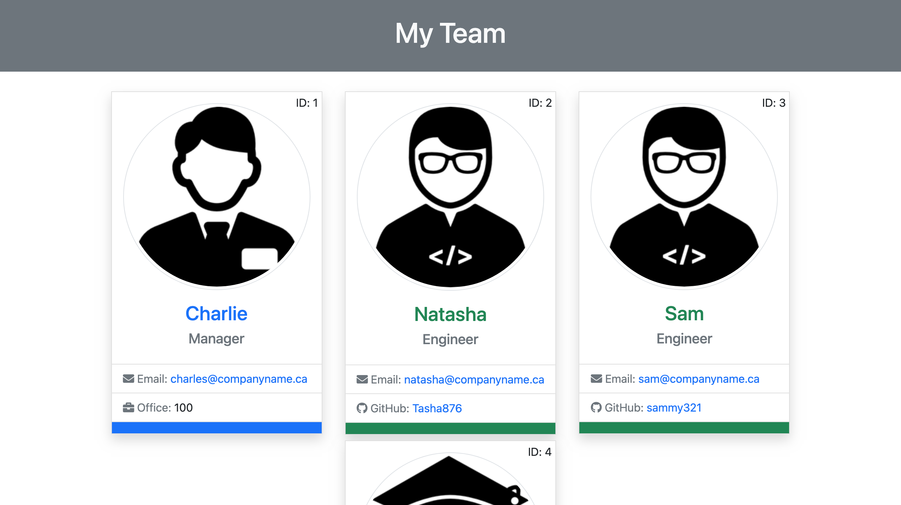

# Employee Summary 

Generates an employee summary in the command line then displays it in html/css.

## Table of Contents
1. [ Install ](#Install)
1. [ Usage ](#Usage)
1. [ Visuals ](#Visuals)
1.  [ Properties ](#Properties)
1. [ Link to Repository ](#Link)
1. [ Authors and Aknowledgement ](#Authors)
1. [ Questions ](#Questions)
1. [ License ](#License)

## 1. Install

You can run by simply downloading, moving to the correct directory in your command line then running 'npm start'.

## 2. Usage

This project can be used to quickly generate a formatted team roster by just typing a into the command line.

## 3. Visuals

## 4. Properties 

* It generates employee summaries quickly using the command line.
* It saves the generated files in the 'generated_files' directory.
* It does not overwrite files, so you can have multiple employee rosters.
* It is styled, so the roster can look attactive as well as convey information.

## 5. Link to the Repository 

Link to the [GitHub repository](https://github.com/tasha876/employee-summary).

## 6. Authors and Aknowledgement 

This project was created entirely by [tasha876](https://github.com/tasha876) with inspiration from the great people at the [UofT Coding Bootcamp](https://bootcamp.learn.utoronto.ca/)

## 7. Issues 

Please direct all issues [here](https://github.com/Tasha876/employee-summary/issues).

## 8. License 

This project is covered by the [MIT](License) license.